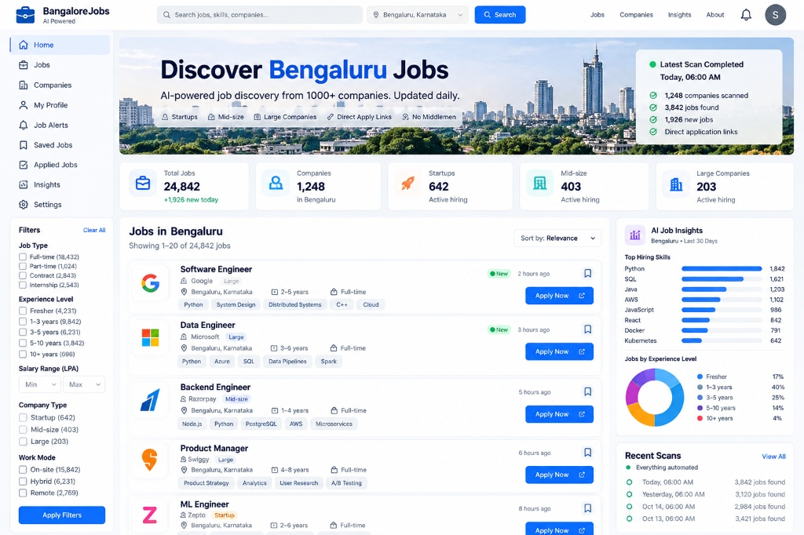
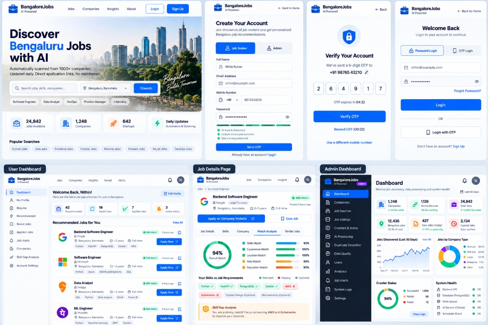
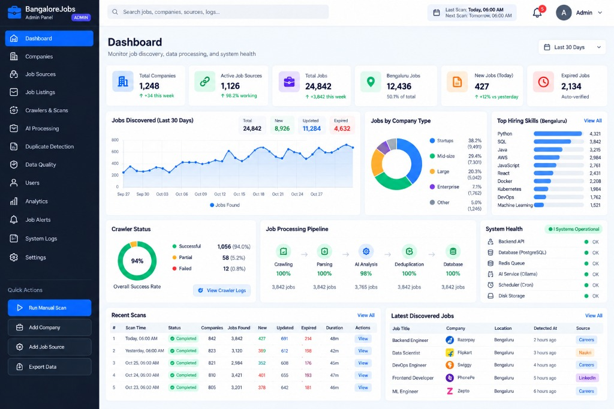

# BangaloreJobs — AI-Powered Job Intelligence & Direct Application Discovery Platform

An AI-powered job discovery platform for Bengaluru, Karnataka, India. Automatically scans permitted company career pages and public feeds on a daily schedule, normalizes job listings, extracts skills, detects duplicates, tracks freshness, and connects candidates directly to official application URLs with explainable match scoring.



### Application Screenshots & Workflows

| Candidate Search & Discovery | Admin Panel & Crawler Health |
|---|---|
|  |  |

## Key Features

- **Daily Automated Ingestion:** Scans authorized job sources, normalizes listings, and tracks job status changes idempotently.
- **Explainable Job Matching:** Ranks candidate fit using transparent weighted scoring (Skill Coverage, Title Match, Experience Fit, Work Mode Fit, Freshness).
- **Skill Gap Breakdown:** Highlights matched skills, missing skills, and optional candidate profile recommendations.
- **Direct Apply Links:** Directs candidates straight to the employer's official application page with no middleman.
- **Admin Operations Dashboard:** Monitors crawler health, processing throughput, data quality metrics, duplicate detection, and system health.
- **Zero Paid API Requirement (₹0 Local Target):** Runs entirely locally using open-source tools (FastAPI, PostgreSQL, React, Vite, Tailwind, optional Ollama / Sentence Transformers).

---

## System Architecture

```
Candidate / Admin Browser (React + TypeScript + Tailwind)
       │ (HTTPS / REST JSON)
       ▼
 FastAPI Backend (Python + Pydantic + SQLAlchemy)
       │
       ├── PostgreSQL (+ optional pgvector)
       │
       └── Daily Scan Orchestrator
             ├── Permitted Connectors (HTTPX / BeautifulSoup)
             ├── Normalization & Rule Engine
             ├── Duplicate Detection & History Tracking
             └── Match Scoring Pipeline
```

---

## Tech Stack

| Layer | Technology |
|---|---|
| **Frontend** | React 18, TypeScript, Vite, Tailwind CSS, Lucide Icons, Recharts |
| **Backend** | Python 3.11+, FastAPI, Pydantic v2, SQLAlchemy ORM, Alembic |
| **Database** | PostgreSQL 15+ (with `pgvector` extension) |
| **Security** | JWT Authentication, Passlib (Argon2 / Bcrypt), Role-Based Access Control |
| **Containerization** | Docker, Docker Compose |
| **Testing** | Pytest, Vitest |

---

## Getting Started

### Prerequisites
- Python 3.11+
- Node.js 18+ and npm
- PostgreSQL 15+ (or Docker Engine / Docker Desktop)
- Git

### Quick Setup

1. **Clone the repository:**
   ```bash
   git clone https://github.com/Nithin560/job-intelligence.git
   cd job-intelligence
   ```

2. **Backend Setup:**
   ```bash
   cd backend
   python -m venv .venv
   source .venv/bin/activate  # On Windows: .venv\Scripts\activate
   pip install -r requirements.txt
   cp ../.env.example .env
   uvicorn app.main:app --reload
   ```

3. **Frontend Setup:**
   ```bash
   cd frontend
   npm install
   npm run dev
   ```

4. **Access the application:**
   - Frontend UI: `http://localhost:5173`
   - FastAPI Interactive API Docs: `http://localhost:8000/docs`

---

## Project Structure

```
job-intelligence/
├── backend/
│   ├── app/
│   │   ├── api/v1/         # REST API Route Handlers
│   │   ├── core/           # Security, Configuration & Logging
│   │   ├── db/             # Database connection & SQLAlchemy Base
│   │   ├── models/         # SQLAlchemy Database Entities
│   │   ├── schemas/        # Pydantic Input/Output Schemas
│   │   ├── connectors/     # Source Registry & Adapters
│   │   ├── pipeline/       # Extraction, Normalization & Deduplication
│   │   ├── services/       # Match Scoring & Search Logic
│   │   └── tasks/          # Scanner Commands & Scheduler
│   └── tests/              # Unit & Integration Tests
├── frontend/
│   ├── src/
│   │   ├── api/            # API Client Functions
│   │   ├── components/     # UI Component Library (Cards, Charts, Modals)
│   │   ├── pages/          # Search, Details, Profile, Admin Pages
│   │   └── types/          # TypeScript Interfaces
│   └── package.json
├── docs/                   # PDF Documentation & Architecture Guides
├── GITHUB_WORKFLOW.md      # Development & Git Commit Standards
├── PLAN.md                 # Phased Implementation Plan
└── compose.yaml            # Local Docker Compose Environment
```

---

## License & Policy Notice

Built with responsible crawling principles: respects `robots.txt`, implements per-host rate limits, stores minimal necessary job metadata, and provides direct links back to original employer postings.
